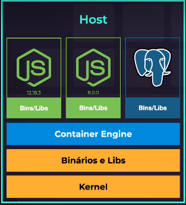

# O que é docker?

Dentro de um Host tem-se o kernel, os binários e libs e a aplicação propriamente,

Virtual Machines: máquinas virtuais executam de forma isolada ao host.

Linux Containers: virtualização a nível de S.O., utilizando o kernel do host.
Neste caso, tem-se

"Container Engine" é o administrador de container, no caso do Docker ele é o container engine.

Um container são aplicações isoladas dentro de uma máquina host.

# Por que utilizar container?

- aplicações de forma isolada;
- faz uso do kernel do host, ao contrário das VM's que utiliza um kernel próprio para cada máquina;
- portabilidade, o mesmo container pode rodar em qualquer máquina da mesma forma.
